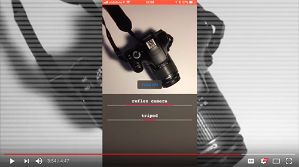

# VisionToy
VisionToy performs image classification on a live video feed and speaks the results back to you. 

This is a toy project where I explored a bit of the new Vision and Core ML frameworks on iOS 11. 
The image classification is backed by a deep convolutional neural network - Inception V3 - provided as a Core ML model. It thinks I use a stethoscope to listen to music and that my table is a wardrobe but apart from that it's pretty cool.

Here's what it looks like:

[VisionToy demo on YouTube](https://youtu.be/WcAMHw1uEww "VisionToy demo on YouTube")
